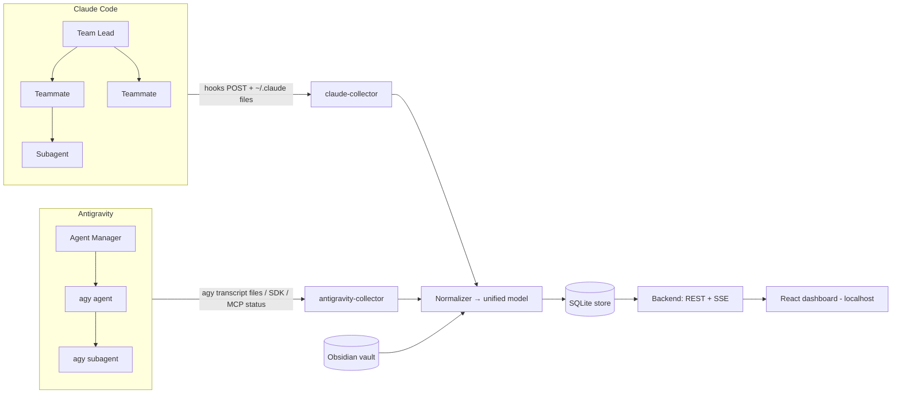
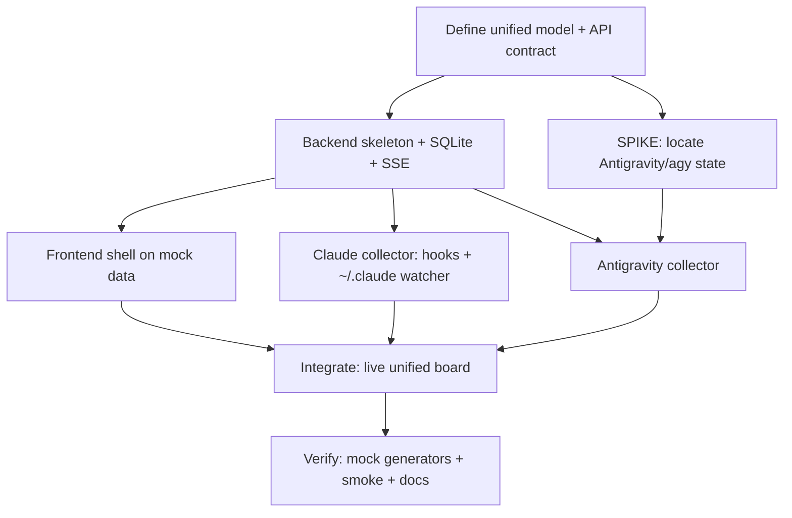

# Federated Agent Control Plane — MVP Plan

**Deliverable type:** Project plan + Claude Code Agent Team spec (you run the team; this document is what it executes)
**MVP scope:** Unified observability (read-only) over two orchestrators
**Interface:** Local web dashboard (React on localhost, viewable in Antigravity's browser)
**Stack:** TypeScript end-to-end (with one optional Python sidecar — see §6)

---

## 1. Honest framing: what we're building (and what we're not)

We are **not** fusing Claude Code Agent Teams and Antigravity Agent Manager into a single orchestrator. Each is designed to be the top-level coordinator, and nesting one inside the other flattens it. That spec is structurally impossible, so we replace it with the achievable one:

> A **federated control plane** — a thin, read-only broker plus a unified dashboard that watches both orchestrators at once. Each native orchestrator keeps coordinating its own subagents underneath; the control plane gives you *one cockpit* to see all of it.

For the MVP this is **observability only**: no dispatch, no task routing, no handoff, and — critically — **zero writes** to either orchestrator. That makes it safe (it can't break a running team), buildable from data sources we know exist, and a clean foundation for Phase 2 (dispatch) and Phase 3 (cross-handoff), sketched in §14.

---

## 2. What "done" means (MVP acceptance criteria)

The MVP is complete when:

1. You run one command and open `http://127.0.0.1:<port>` in Antigravity's built-in browser.
2. You see, **updating live**, for *both* orchestrators side by side:
   - each orchestrator and whether it's active;
   - its agents (Claude team-lead + teammates + subagents; Antigravity Agent Manager agents + `agy` subagents) with current **state** (queued / running / blocked / succeeded / failed / idle);
   - each agent's **current task** and last action;
   - a combined, chronological **event feed** across both systems.
3. State **survives a restart** (persisted), and history is queryable.
4. The control plane **never writes** to `~/.claude`, Antigravity state, or the repo — read-only by construction.
5. A **vault panel** shows the most recent handoffs/decisions from the Obsidian vault (ties into your existing setup).

---

## 3. Architecture overview



Five parts:

1. **Collectors** — one adapter per orchestrator. They read each system's native state and normalize it. New orchestrators (gastown, Paperclip) are added later as new collectors — the same adapter pattern Paperclip and gastown themselves use.
2. **Normalizer + unified model** — the heart of the project: a vendor-neutral schema both collectors map onto (§5).
3. **Store** — SQLite (durable, simple, gives you history and restart-survival).
4. **Backend** — a small Fastify (Node/TS) service: ingests from collectors, persists, exposes REST for snapshots + SSE/WebSocket for live updates.
5. **Frontend** — React + Vite dashboard on `127.0.0.1`, rendering the unified board and event feed.

Data flow: orchestrators work → emit state (hooks / files) → collectors normalize → backend stores + broadcasts → dashboard renders live.

---

## 4. Data sources (the load-bearing detail)

Neither orchestrator ships an official "observability API," so we read their state. Each side has a **known baseline** and a **better push option**.

### 4.1 Claude Code side (well-understood)

- **Filesystem watcher on `~/.claude/`** — baseline + backfill. Confirmed subpaths include `~/.claude/projects/` (session JSONL), `~/.claude/todos/`, `~/.claude/teams/`, `~/.claude/file-history/`, `~/.claude/settings.json`. Agent Teams persists the shared task list and teammate state here. Watch with `chokidar`, parse incrementally.
- **Claude Code hooks → local webhook** — the real-time push channel (preferred). Register hooks that POST each event to the backend:
  - `SessionStart` → agent/team came online
  - `PostToolUse` → activity / current action
  - `SubagentStop` → a subagent finished
  - `Stop` → session/teammate done
  A tiny shim script (`ctl-emit`) reads the hook's stdin JSON and POSTs it to `http://127.0.0.1:<port>/ingest/claude-code`.

### 4.2 Antigravity side (one unknown to spike first)

- **`agy` transcript files** — baseline. `agy` writes per-session transcripts to disk (this is how the existing community `agy`→Claude MCP bridge reads results). **The exact path is under-documented and is the #1 spike (M0):** check `~/.antigravity/`, `~/.gemini/`, and `%LOCALAPPDATA%\Antigravity\`. Once located, watch like the Claude side.
- **Antigravity Python SDK (optional, cleaner)** — if it exposes run/agent status queries, a small Python sidecar collector can poll it and POST normalized events to the backend. This is the only reason the stack may need Python (see §6).
- **MCP "status report" tool (optional push)** — the control plane can expose a tiny MCP server with a `report_status` tool, and an Antigravity *rule* can instruct its agents to call it on start/finish. Push-based, but depends on agent cooperation.

### 4.3 Vault (secondary)

Read the Obsidian vault's `journal/` and `messages/` for a "recent handoffs/decisions" panel. Read-only; same `chokidar` watcher.

> **Design rule:** prefer **push** (hooks / MCP) for liveness, **file-watch** for completeness and backfill. Keep every parser defensive — both orchestrators' on-disk schemas are unofficial and may change.

---

## 5. Unified data model (the core contract)

Everything normalizes to this. Define it first; it's the API contract the frontend and both collectors agree on.

```ts
type OrchestratorId = "claude-code" | "antigravity";
type RunState = "queued" | "running" | "blocked" | "succeeded" | "failed" | "idle";

interface AgentNode {
  id: string;                  // stable within its orchestrator
  orchestrator: OrchestratorId;
  role: string;                // "team-lead" | "teammate" | "subagent" | "agent-manager" | "agy-agent" | "agy-subagent"
  parentId?: string;           // subagents/teammates point at their coordinator
  title: string;
  state: RunState;
  currentTaskId?: string;
  model?: string;              // e.g. "claude-opus-4-6", "gemini-3-pro"
  tokens?: { input: number; output: number };
  updatedAt: string;           // ISO
}

interface TaskNode {
  id: string;
  orchestrator: OrchestratorId;
  title: string;
  state: RunState;
  assigneeId?: string;
  parentTaskId?: string;
  createdAt: string;
  updatedAt: string;
}

interface AgentEvent {
  id: string;
  orchestrator: OrchestratorId;
  ts: string;                  // ISO
  kind: "session_start" | "task_update" | "tool_use" | "subagent_stop" | "session_stop" | "message" | "error";
  agentId?: string;
  taskId?: string;
  summary: string;
  raw?: unknown;               // keep original payload for debugging
}
```

Collector interface (every orchestrator implements this):

```ts
interface Collector {
  id: OrchestratorId;
  backfill(): Promise<{ agents: AgentNode[]; tasks: TaskNode[] }>;          // initial state
  start(emit: (e: AgentEvent) => void,
        upsert: (n: AgentNode | TaskNode) => void): Promise<void>;          // live updates
  stop(): Promise<void>;
}
```

---

## 6. Tech stack

| Layer | Choice | Why |
|---|---|---|
| Language | **TypeScript** | One language for a learner; best MCP SDK; fits the ecosystem |
| Backend | **Fastify** + **better-sqlite3** | Tiny, fast, synchronous SQLite is plenty for local single-user |
| Live updates | **SSE** (fallback WebSocket via `ws`) | Simplest reliable push to the browser |
| File watching | **chokidar** | Robust cross-platform watcher for `~/.claude` + agy transcripts |
| Frontend | **React + Vite + Tailwind** | Fast dev loop; renders in Antigravity's browser |
| MCP (Phase 2+) | **@modelcontextprotocol/sdk** | For dispatch and the optional status-report tool |
| Optional sidecar | **Python** (only if using the Antigravity SDK) | The SDK is Python; isolate it as a separate collector process |

Bind everything to `127.0.0.1` only. It reads sensitive `~/.claude` data — never expose it.

---

## 7. Build milestones

- **M0 — De-risk & contract.** Run the Antigravity state-location spike (§4.2). Finalize the unified model (§5) and the REST/SSE API contract. *Exit:* schema frozen, Antigravity data source confirmed.
- **M1 — Vertical slice on mock data.** Backend skeleton + SQLite + SSE; React shell renders mock agents/tasks/events end-to-end. *Exit:* fake data flows screen-to-store-to-screen live.
- **M2 — Claude collector (real).** `~/.claude` watcher + hook kit (`ctl-emit`) → real Claude Code Agent Teams data on the board.
- **M3 — Antigravity collector (real).** `agy` transcript watcher (+ optional SDK/MCP) → real Antigravity data on the board.
- **M4 — Unify & verify.** Combined event feed, status colors, vault panel; mock event generators for both orchestrators; end-to-end smoke test; README/runbook.

---

## 8. The Claude Code Agent Team

You'll run this with Claude Code's **Agent Teams** (the team lead coordinates teammates via a shared task list). Suggested composition:

| Role | Owns | Scope notes |
|---|---|---|
| **Team Lead — Architect** | Unified model (§5), API contract, integration, reviews, merges | Doesn't write feature code; owns coherence and the task list |
| **Teammate A — Core/Backend** | Fastify service, SQLite store, SSE, mock-data ingestion | Produces the API contract first so others can parallelize |
| **Teammate B — Claude collector** | `~/.claude` watcher, hook kit (`ctl-emit`), normalizer | Depends on the model from the Lead/Core |
| **Teammate C — Antigravity collector** | M0 spike, `agy` transcript watcher, optional SDK/MCP reporter | Highest uncertainty — starts with the spike |
| **Teammate D — Frontend** | React/Vite dashboard, SSE client, unified board, vault panel | Builds against mock data in parallel, swaps to real later |
| **Teammate E — QA/Verify** *(optional)* | Mock generators for both orchestrators, smoke tests, runbook | Lets the Lead verify without a live team running |

---

## 9. Task graph (dependency-ordered)



Dependencies for your team's task list (`blockedBy`):

- `T1`, `SPIKE` ← blocked by `T0`
- `FE`, `CC`, `AG` ← blocked by `T1`; `AG` also blocked by `SPIKE`
- `INT` ← blocked by `CC`, `AG`, `FE`
- `VER` ← blocked by `INT`

This is acyclic and lets **FE, CC, and the AG-spike run in parallel** after the contract (T0) and skeleton (T1) land — which is exactly what Agent Teams is good at.

---

## 10. How the team coordinates

- **Branch strategy:** one git worktree per teammate (Core, Claude-collector, Antigravity-collector, Frontend) to avoid write conflicts; Lead integrates. (Recommended in your provisioning prompt.)
- **Vault as the record:** point the team at your Obsidian vault — `spec/` holds this plan, `decisions/` logs schema/API choices, `journal/` gets per-session summaries, `handoffs/` carries "where I left off." This both coordinates the team and becomes the data the dashboard's vault panel displays (nice self-referential test).
- **Contract-first:** nobody builds against guesses — Teammate A publishes the API contract from §5 before B/C/D go wide.

---

## 11. Risks & unknowns

| Risk | Mitigation |
|---|---|
| **Antigravity state path/format undocumented** (biggest) | M0 spike before committing; baseline on `agy` transcripts (known to exist); fall back to SDK/MCP push |
| **Agent Teams is experimental / schema may change** | Pin a Claude Code version; isolate all `~/.claude` parsing behind the collector so a schema change is one-file |
| **Liveness vs completeness** | Push (hooks/MCP) for real-time, file-watch for backfill; reconcile in the normalizer |
| **Unofficial schemas drift** | Defensive parsers; store `raw` payloads; never crash the backend on a bad record |
| **Scope creep toward dispatch** | Enforce read-only in v1 at the architecture level (no write paths exist) |

---

## 12. Prerequisites & first run

1. **Claude Code** installed and logged in with your Pro plan; **Agent Teams enabled** (it's experimental/off by default — enable it in settings).
2. **Node 20+**, **Antigravity 2.0** with the `agy` CLI installed.
3. A repo for the control plane (new or a `control-plane/` folder in your project).
4. Kick off the team with a lead prompt that points at this file as the spec, e.g.:
   > "You're the team lead. Read `spec/federated-agent-control-plane-plan.md`. Build the MVP per §2 acceptance criteria, following the task graph in §9 with the roles in §8. Use a worktree per teammate, log decisions to `decisions/`, and post handoffs to `handoffs/`. Start with T0 (the unified model + API contract) and the M0 Antigravity spike."

---

## 13. Roadmap beyond the MVP

- **Phase 2 — Dispatch.** Add write paths: create/route a task to either orchestrator from the dashboard. Claude via `claude mcp serve` (control plane as MCP client) or headless `claude -p`; Antigravity via `agy --print` (the `process` path) or the SDK.
- **Phase 3 — Cross-handoff.** Auto-relay one orchestrator's output into the other as input, brokered through the vault + MCP (e.g., Claude finishes implementation → control plane files a verification task to an `agy` agent).
- **Phase 4 — More collectors.** Drop in gastown / Paperclip collectors using the same `Collector` interface — at which point this is a genuine multi-orchestrator command center.
